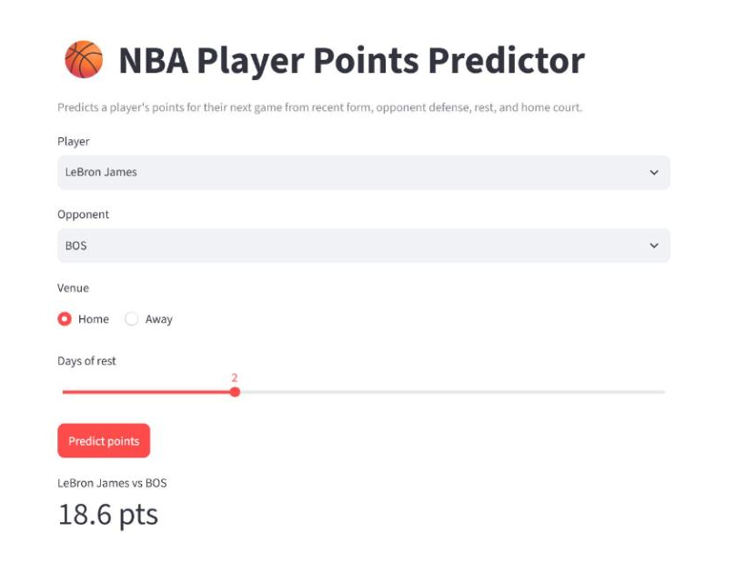

# NBA Player Points Predictor

Predicts how many points an NBA player will score in their next game from recent
form, opponent defensive strength, days of rest, and home-court advantage. Trained
on the last two seasons of league game logs and served through a small Streamlit
app.

## Demo

```
streamlit run app.py
```

Pick a player and opponent, set rest days and venue, and the app returns a single
predicted point total using the model saved in `models/model.pkl`.



## How it works

**Data.** `src/fetch_data.py` pulls every player's game log for the last two
seasons in one call per season via the `nba_api` `LeagueGameLog` endpoint, and
caches the raw CSVs under `data/raw/` so re-runs don't hit the API.

**Features.** `src/features.py` builds one row per player-game using only
information available *before* that game, to avoid target leakage:

- Rolling means of points, minutes, and FG% over the last 5 and 10 games
- Opponent's rolling average points allowed coming into the game
- Days of rest since the player's previous game, plus a back-to-back flag
- Home/away flag

Players with fewer than 20 games in the window are dropped as non-rotation noise.

**Model.** `src/train.py` uses a time-based split (earlier games train, later
games test) and compares a linear regression baseline against a random forest on
MAE and RMSE. The better model is refit on all games and saved with `joblib`.

Current results on ~51k player-games (80/20 time split):

| Model             | MAE  | RMSE |
|-------------------|------|------|
| Linear regression | 4.72 | 6.15 |
| Random forest     | 4.75 | 6.19 |

Linear regression wins narrowly and is the model shipped in `models/model.pkl`.

**Prediction.** `src/predict.py` loads the saved model and the engineered game
table, derives a player's current form from their most recent games, looks up the
chosen opponent's latest defensive number, and returns the predicted points
(floored at zero).

## Project layout

```
.
├── app.py               # Streamlit UI
├── src/
│   ├── fetch_data.py     # nba_api pulls -> data/raw/
│   ├── features.py       # feature engineering
│   ├── build_dataset.py  # runs fetch + features -> data/processed/training_data.csv
│   ├── train.py          # trains, evaluates, saves the model
│   └── predict.py        # loads the model, makes a single prediction
├── models/model.pkl      # trained model (committed so the app works out of the box)
├── tests/                # pytest suite over feature and prediction logic
└── requirements.txt
```

`data/` is regenerable and gitignored.

## Setup

```
python -m venv .venv
.venv\Scripts\activate        # Windows
source .venv/bin/activate     # macOS / Linux
pip install -r requirements.txt
```

## Usage

Rebuild the training data and model from scratch:

```
python src/build_dataset.py   # fetch + engineer -> data/processed/training_data.csv
python src/train.py           # evaluate models, save models/model.pkl
```

Run the app:

```
streamlit run app.py
```

## Tests

```
pytest
```

The suite uses small synthetic fixtures and needs no network access.

## Notes and limitations

- A single global model treats player identity only through recent stats, so it
  regresses hot and cold streaks toward the mean.
- Injuries, lineup changes, and blowout garbage time aren't modeled.
- Predictions are only as fresh as the last `python src/build_dataset.py` run.
